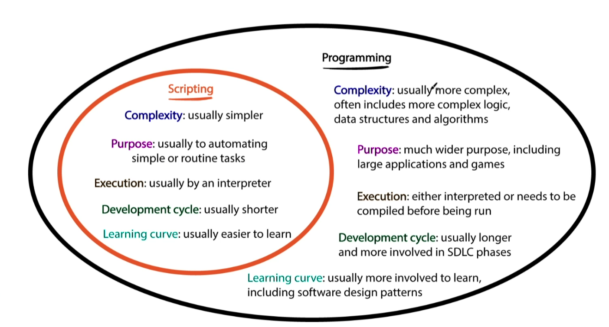

# what is scripting?

## what is it?

* writing small, often quick and dirty
* purpose:
  * automate tasks/bug fix
  * manipulate data
  * preform specific actions that don't require a full-fledge application

## use cases for using scripting 
* Python script to query a database
* Python script to execute a shell command or script
* Query logs for alerts
* Python script to take a backup
* Python script for K8 containers
* Python script to fetch IP addresses of an autoscaling group
* Lambda function to stop instances on a weekend
* Python script for ETL jobs
* Find the expiry date of an SSL certificate
* Develop CLI applications using Python
* Automating CRUD
* Custom scripts for config management

## API Learning

