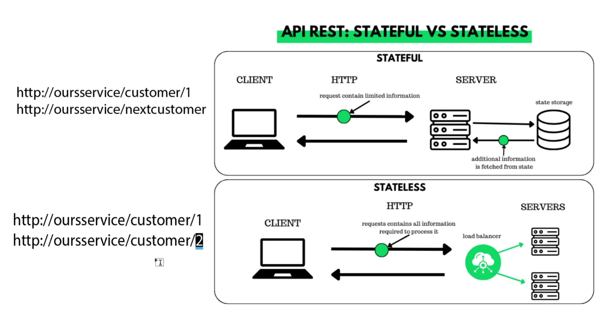

# API Fundamentals

## What are APIs? How are they used and why are they so popular?

What is an API?
* Application Programming Interface
* * provides a service that...
* gives access to resources: data,images,videos,webpages
* allows you to take a certain action
* API is built to represent certain resources

From an API providers perspective:
* Provide a service that is east to implement, maintain, extend and scale

Why might DevOps/Support engineers need to use API's
* Automation interactions with cloud services, esp for configuration/administration
* Simulate user actions or workflows to try reproduce and test issues 
* Accessing data to help troubleshoot/diagnosis
* retrieve and manipulate data from external systems and services

## Create a diagram to showcase the data transfer process in API communication.

* often uses JSON:
OR
* often uses XML:

## What is a REST API? What makes an API RESTful? What are the REST guidelines?

* Rest
  * Representation State Transfer
  * type of architecture used for API
  * Primarily used to web services that are light weight, maintainable and scalable 
  * also called a RESTful service
  * uses HTTP as its protocol 
  
* if its RESTful must have these properties
  * Representation and data flow
  * messages
  * URI / Naming resources
  * stateless
  * caching 

## What is HTTP? (what does it stand for and what is it used for? What is HTTPS?)

* HTTP = Hyper text transfer protocol 
  * the protocol of internet communication
  
   

* HTTPS is the secure/encrypted version
requests / response 

## Explain HTTP request structure using the diagrams provided, or your own.

## Explain HTTP response structure using the diagram provided, or your own.

## What are the 5 HTTP verbs and what do they do?

verb → operation
GET → Read 
POST → Create
PUT → Update
PATCH → Update (partial)
DELETE → delete

## URIs and naming of resources

examples
http://ourservice/customer\1

or

http://ourservice/customer=id4

## What is statelessness? Show examples of “stateless” and stateful http requests.
* REST API's are stateless

## What is caching?
dynamic dont have to mention 