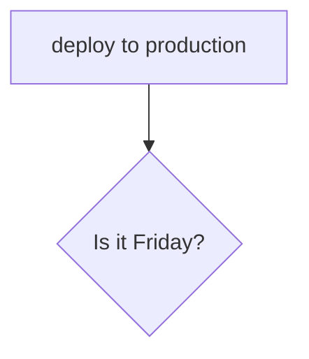

# Learn markdown
### subheadings 

uses hashes 

### Marking code

how you print something to screen in python: `print('Hello World')`

> Note: hello this is a separate note!
> 
<br>

## list

* bullet points 1
* bp2
* bp3

### Tickbox
- [ ] Apples
- [ ] pears
- [x] oranges

## Tables


## mermaid 
```
pie title smartphone users 
" iphone" : 30 
"samsung" : 60 
"pixel" :10
```

### comment out something

[//]: # (need to comment this out )

1. sub item 1
2. sub item 2
3. sub item3
 
### Images 


### link to google
Click to go to [Google](https://google.com)

## Extra markdown

## how to deploy




