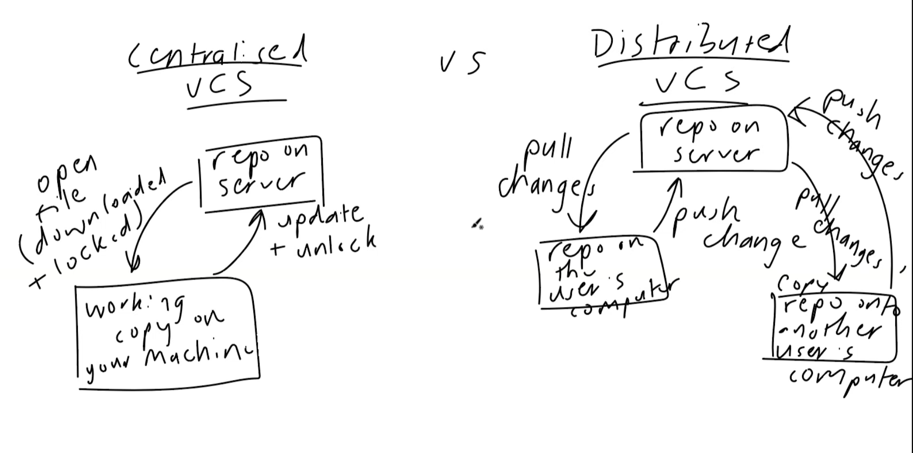
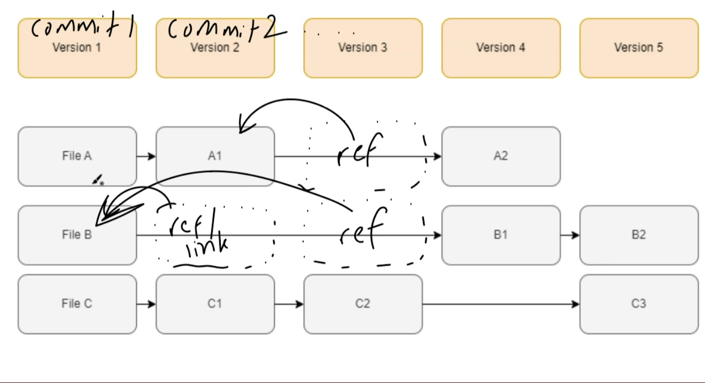
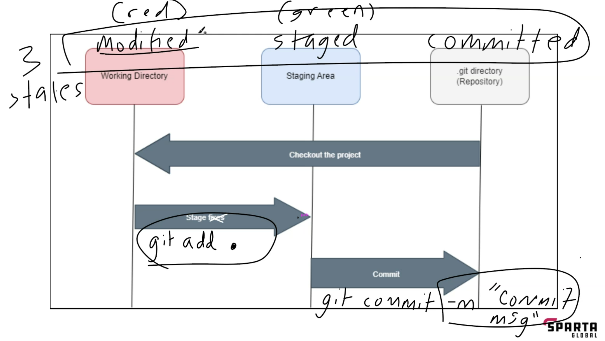

# Documentation of learning python

### A variable is a name that stores values or object data
###  It's called a variable as you are able to change the value over time as its only a placeholder

# Assigning Variables
````
    #String
First_Name = "John"
Last_Name = "Smith"
Name = First_Name + " " + Last_Name
#integers
Age = 26
#float
Bank_Balance = 59.99
#boolean
Can_Drive = True
#equal to ==
A = [1,2,3]
B = [1,2,3,4]
A == B

#Printing the Name, Age, Bank Balance & Whether they can drive
print("Your name is: " + Name,)
print(f"Your age is: {Age}")
print(f"Your Bank_Balance is: £{Bank_Balance}")
print(f"You Can_Drive is: {Can_Drive} ")
print(A == B) #WIll give false as an answer as they are not the same
````
### Strong Typed vs Weak Typed Language.
* A strongly typed Programming language is one that the data is predefined 
  * This means that the compiler can detect errors relating to incorrect variable types during compilation and execution.
* A weak typed programming language is one where the data/type can change
```
Weak Type languange like JavaScript
"a" + 1
= 'a1'
Python
"a" + 1
= 1 "a" + 1
Would get a typeError can onlt concatenate str(not "int") into str
```

### Dynamic vs statistic typing
* dynamic typing is when a variable is checked during runtime, meaning variables can change as program executes.
* static typic is when variable is checked at compile time meaning the type is fixed and can't be changed after codes compiled. 

```
#Python strong typed language example
bob = 1
bob = ("bob")

print(bob)
```
* But what does this mean? 
  * Python is a language where you don't have to declare the specific type of variable that it is as it will work it out itself.
  * it can determine whether the text you provided is a string, integer or float. 

<br>   
  
* How is this Helpful?
  * quicker writing code.
  * makes code cleaner


  
* What are the disadvantages?
  * Runtime errors, errors are caught in runtime which may lead to bugs.
  * may lead to a slower performance as it has to check the type before running. 
  * Variables can change making it harder to debug

x = 10
<br>
y = X
<br>
Therefore
<br>
Y = 10

### So if you change the value of X the value of Y will change also. 

## operator and operand 
* Operators are the tokens that represent computation like addition, multiplication and division.
* Operand are the values the operator works on 
``` 
x = 5
y = 1
a = 12
b = 14
c = 14
#Addition
print(x + y)
#subtraction
print(a - b)
#Multiplication
print(a * b)
#division
print(a / x )
#Floor division divides 2 numbers and rounds to nearest whole number
print(a // b)
#Modulus/percent - absolute value
print(a % x)
#exponentation - base number multiplied by itself a number of times
print(x ** b)
#Equal to
print(b == c)
#not equal to
print(a == 12)
# Greater than B
print(a > b)
# Less than B
print(a < b)
#greater or equal to
print(a >= b)
#less than or equal to
print(a <= b)

```
## Creating strings and quotes appropriately
``` 
bad_string = "I said 'Wow!'"
print(bad_string)

bad_string = 'I said "Wow!"'
print(bad_string)

bad_string = 'I said `Wow!`'
print(bad_string) 
```

* Here are three difference ways to get the : I said `Wow! in quotes 
  * the reason it failed is that it used the same quote for the whole sentence and the word wow which cause it to get stuck of where needs to be quoted.

  <br>
* Opinion: What is best practice when deciding what quotes to use around strings in Python? 
  * Single quotes for names of data files  and double quotes for presentation. 

# String Slicing
``` 
Hw = "Hello world!"
print(Hw)
print(Hw[0:5])
print(Hw[6:12])
print(Hw[-2:6])
print(Hw[1])
# the [] is determining what letter and what position from 0 - 12 characters.
```
# Intro to Version Control and Git

## Version Control System

### What is a Version Control System (VCS)
*helps you track/manage/save/record changes to a file or set of files over time so we can recall specific versions later.

### Benefits
* Revert changes for a file or all files back to specific version
* compare changes over time
* view who made changes and when
* able to accept changes 

### Types of version control

#### What is manual version control
* when you make a copy of a file or folder of files with name like v1.1

#### How did early version control systems work
* Tracked changes to individual files 
* base file to start, then each version of file saved a delta(changes made since last version)
* to get latest version, had to use base file + all deltas 
#### Centralised VCS vs Distributed VCS like Git
* centralised - a set of files on server - 
  * download file to machine and is locked to your device so only you can make changes. 
  * then sends a copy to the server to update it- making file unlocked after.
* Distributed - have files on pc 
  * then can push change onto a repo on a server ( repo is a folder tracked for version control)
  * then other people can come along and make a copy (pull changes) onto their machine and get a repo copy. 
  * once changes are made they can push their copied changes onto repo server, leaving the original person to loop the progress of pulling and pushing.

## Local Version Control with Git
*
### What is stored in each version of a file that changes
* Stores the snapshot of the whole file that has been changed
* Stores the files into a commit 

### What does Git store in a 'commit'

### Does Git need to be used as a distributed VCS
* No but better to be distributed to get benefits like having a backup copy, sharing with other, collaborating a set of files with a team. 

## The three states in Git
> working directory
  * Stage Fixes
  * `git add .` (. = everything in directory)
> staging areas
  * Commit
  * `git commit -m` (commit message)
> .git directory (repository)
  * Checkout the project - commited

### Where does Git store its information
* `.git` folder (if it starts with a . its a hidden folder)
### Common workflow of Git commands
* turn a normal folder into a git repo: `git init`
* To save changes to the set of file in Git repo:
1. Stage the all the files in folder `git add .`
2. commit the changes `git commit -m "aprropriate commit message`
